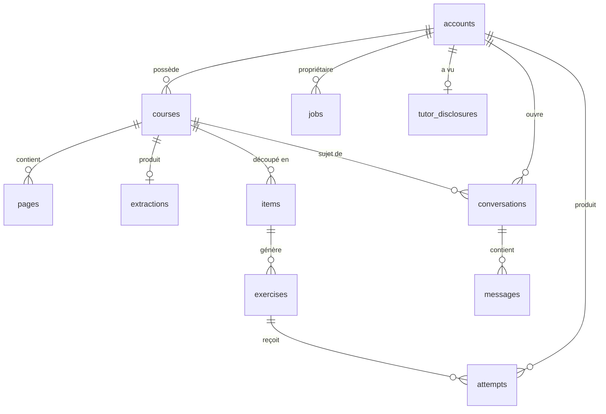

# StudiaKids — Schéma de données

SQLite via `better-sqlite3` + Drizzle ORM, comme StudIA
(`docs/inventaire-studia.md`, §1). `journal_mode=WAL`,
`busy_timeout=5000`, `synchronous=NORMAL`, `foreign_keys=ON` réglés une fois
à l'ouverture. Migrations exécutées une fois au démarrage, jamais par
requête.

Ce document consolide les tables déjà détaillées dans chaque
`docs/modules/*.md` — en cas de divergence, le fichier de module fait foi
et ce document doit être corrigé pour correspondre, pas l'inverse.

Vocabulaire : voir `docs/glossaire.md` pour la correspondance entre les
termes de prose et les identifiants de ce schéma.

**Un compte égale un enfant.** Pas de table `profiles` séparée : le prénom
et le niveau vivent directement sur `accounts`. Convention transversale :
**toute table qui porte de la donnée d'un enfant a une colonne `user_id`**,
référençant `accounts(id)` — règle n°1 de `CLAUDE.md`. Dates en ISO 8601
UTC. IDs en UUID v7, générés en couche application, jamais par SQLite.

---

## Vue d'ensemble



---

## `auth` (`docs/modules/auth.md`)

```sql
CREATE TABLE accounts (
  id TEXT PRIMARY KEY,
  username TEXT NOT NULL UNIQUE,
  password_hash TEXT NOT NULL,
  session_version INTEGER NOT NULL DEFAULT 1,
  first_name TEXT NOT NULL,
  grade TEXT NOT NULL CHECK (grade IN ('CP','CE1','CE2','CM1','CM2','6e')),
  created_at TEXT NOT NULL
);
```

Aucune table `profiles`. Un second enfant dans le même foyer est un second
compte, créé par le même script CLI.

## `ingestion` (`docs/modules/ingestion.md`)

```sql
CREATE TABLE courses (
  id TEXT PRIMARY KEY,
  user_id TEXT NOT NULL REFERENCES accounts(id) ON DELETE CASCADE,
  title TEXT NOT NULL DEFAULT '',
  subject TEXT CHECK (subject IN ('maths','french','history','geography','science','english','other')),
  grade TEXT NOT NULL CHECK (grade IN ('CP','CE1','CE2','CM1','CM2','6e')),
  color TEXT NOT NULL DEFAULT '',
  extraction_status TEXT NOT NULL CHECK (extraction_status IN ('pending','running','illegible','not_a_course_page','ready')),
  generation_status TEXT NOT NULL DEFAULT 'not_started' CHECK (generation_status IN
    ('not_started','splitting','insufficient_coverage','items_ready','generating','ready','failed')),
  confirmed INTEGER NOT NULL DEFAULT 0,
  created_at TEXT NOT NULL,
  last_accessed_at TEXT NOT NULL
);
CREATE INDEX idx_courses_user_last_accessed ON courses(user_id, last_accessed_at DESC);

CREATE TABLE pages (
  course_id TEXT NOT NULL REFERENCES courses(id) ON DELETE CASCADE,
  page_index INTEGER NOT NULL,
  sha256 TEXT NOT NULL,
  stored_path TEXT NOT NULL,
  size_bytes INTEGER NOT NULL,
  legible INTEGER,               -- NULL tant que non traité, 0/1 ensuite
  is_course_page INTEGER,        -- idem
  unusable_reason TEXT,
  markdown TEXT,                -- ce que la page a lu, gardé entre les tentatives
  PRIMARY KEY (course_id, page_index),
  UNIQUE (course_id, sha256)
);

CREATE TABLE extractions (
  course_id TEXT PRIMARY KEY REFERENCES courses(id) ON DELETE CASCADE,
  markdown TEXT NOT NULL,
  extracted_at TEXT NOT NULL
);
```

`failed` n'est jamais stocké dans `extraction_status` : il est dérivé à
la lecture du dernier job `extract-course` du cours
(`docs/modules/ingestion.md`, "Statut `failed`").

`generation_status` est déclarée ici (elle vit sur la table `courses`,
propriété d'`ingestion`) mais uniquement écrite par `exercise-generator` —
même schéma de propriété que StudIA pour ses colonnes composées entre
modules voisins. **Elle n'existe pas encore** : elle arrive avec la
migration de M3 (`docs/modules/exercise-generator.md`), la migration de
M2 ne crée que les colonnes d'`ingestion`.

**Les photos (`pages`, et les fichiers qu'elles référencent) sont
conservées tant que le cours existe** — décision actée, `docs/securite.md`
— et supprimées uniquement par `ON DELETE CASCADE` avec `courses`, en même
temps que leurs fichiers sur le volume (l'application doit supprimer les
deux dans le même appel, `docs/modules/ingestion.md`).

## `exercise-generator` (`docs/modules/exercise-generator.md`)

```sql
CREATE TABLE items (
  id TEXT PRIMARY KEY,
  course_id TEXT NOT NULL REFERENCES courses(id) ON DELETE CASCADE,
  user_id TEXT NOT NULL REFERENCES accounts(id),
  title TEXT NOT NULL,
  body TEXT NOT NULL,
  game_types_json TEXT NOT NULL,   -- GameType[]
  position INTEGER NOT NULL,
  created_at TEXT NOT NULL,
  UNIQUE (course_id, position)
);
CREATE INDEX idx_items_course ON items(course_id, position);

CREATE TABLE exercises (
  id TEXT PRIMARY KEY,
  item_id TEXT NOT NULL REFERENCES items(id) ON DELETE CASCADE,
  user_id TEXT NOT NULL REFERENCES accounts(id),
  type TEXT NOT NULL CHECK (type IN
    ('delayed_copy','mcq','matching','reordering','cloze','true_false','mental_math')),
  content_json TEXT NOT NULL,
  created_at TEXT NOT NULL
);
CREATE INDEX idx_exercises_item ON exercises(item_id);
```

`items` peut être alimentée par deux chemins : le découpage complet du
cours (`split-items`, remplace tout) et l'ajout par extrait depuis le
tuteur (`game-from-excerpt`, ajoute à la suite des positions existantes,
ne touche jamais aux items déjà présents) — voir
`docs/modules/exercise-generator.md`, "Découpage à partir d'un extrait".

## `game-engine` (`docs/modules/game-engine.md`)

```sql
CREATE TABLE attempts (
  id TEXT PRIMARY KEY,
  user_id TEXT NOT NULL REFERENCES accounts(id),
  exercise_id TEXT NOT NULL REFERENCES exercises(id) ON DELETE CASCADE,
  type TEXT NOT NULL,
  unit_id TEXT NOT NULL,             -- '0' pour un exercice à réponse unique
  correct INTEGER NOT NULL,
  star_eligible INTEGER NOT NULL DEFAULT 1,
  given_answer_json TEXT NOT NULL,
  attempted_at TEXT NOT NULL
);
CREATE INDEX idx_attempts_user ON attempts(user_id, attempted_at);
CREATE INDEX idx_attempts_exercise ON attempts(exercise_id);
```

Append-only : aucune ligne n'est modifiée après écriture, sauf suppression
en cascade si son exercice parent est supprimé (régénération). `progress`
lit cette table exclusivement via l'`index.ts` de `game-engine`, jamais en
SQL direct — aucune table propre à `progress` (`docs/modules/progress.md`).

## `tutor` (`docs/modules/tutor.md`)

```sql
CREATE TABLE conversations (
  id TEXT PRIMARY KEY,
  user_id TEXT NOT NULL REFERENCES accounts(id),
  course_id TEXT NOT NULL REFERENCES courses(id) ON DELETE CASCADE,
  title TEXT,
  created_at TEXT NOT NULL
);
CREATE INDEX idx_conversations_scope ON conversations(user_id, course_id);

CREATE TABLE messages (
  id TEXT PRIMARY KEY,
  conversation_id TEXT NOT NULL REFERENCES conversations(id) ON DELETE CASCADE,
  role TEXT NOT NULL CHECK (role IN ('user','assistant')),
  content TEXT NOT NULL,
  citations_json TEXT,
  issue TEXT CHECK (issue IN ('off_topic','sensitive','distress')),
  out_of_band INTEGER NOT NULL DEFAULT 0,   -- 1 uniquement pour issue='distress'
  partial INTEGER NOT NULL DEFAULT 0,
  created_at TEXT NOT NULL
);
CREATE INDEX idx_messages_conversation ON messages(conversation_id);

CREATE TABLE tutor_disclosures (
  user_id TEXT PRIMARY KEY REFERENCES accounts(id) ON DELETE CASCADE,
  shown_at TEXT NOT NULL
);
```

Une ligne dans `tutor_disclosures` signifie "le message informant que
l'historique est consultable par l'adulte a déjà été montré à ce compte" —
volontairement indépendante de `conversations`/`messages` pour survivre à
la suppression de n'importe quelle conversation ; seule la suppression du
compte l'efface (`docs/modules/tutor.md`, "Information de l'enfant sur la
consultation par l'adulte").

`out_of_band` est un booléen pour l'instant (un seul cas hors fil existe :
`distress`) ; il pourra devenir une colonne `kind` si d'autres messages
hors fil apparaissent (voir `docs/glossaire.md`, entrée `out_of_band`).

Toutes les conversations, y compris les messages `issue='distress'`, sont
conservées tant que le cours existe et supprimées en cascade avec lui —
aucune politique de rétention plus courte pour elles : elles doivent rester
consultables par l'adulte titulaire du compte (`docs/securite.md`,
"Consultable, jamais secret").

## `jobs` — noyau partagé, frozen (recopié de StudIA)

```sql
CREATE TABLE jobs (
  id TEXT PRIMARY KEY,
  user_id TEXT NOT NULL REFERENCES accounts(id) ON DELETE CASCADE,
  type TEXT NOT NULL,
  payload_json TEXT NOT NULL,
  status TEXT NOT NULL CHECK (status IN ('pending','running','done','failed')),
  attempts INTEGER NOT NULL DEFAULT 0,
  max_attempts INTEGER NOT NULL DEFAULT 3,
  last_error TEXT,
  run_after TEXT NOT NULL,
  created_at TEXT NOT NULL,
  updated_at TEXT NOT NULL
);
CREATE INDEX idx_jobs_claim ON jobs(status, run_after);
CREATE INDEX idx_jobs_user ON jobs(user_id, type, created_at DESC);
```

Types de job attendus : `extract-course` (`ingestion`), `split-items`,
`generate-item-exercises` et `game-from-excerpt` (`exercise-generator`,
ce dernier déclenché par `tutor` via l'`index.ts` de
`exercise-generator`). Mécanisme de queue et machine à états
entièrement recopiés de StudIA (`docs/inventaire-studia.md`, §8),
`user_id` colonne pour colonne comme dans StudIA — **à une divergence
près, validée** : `ON DELETE CASCADE` sur `user_id`, absent de StudIA,
sans quoi `pnpm accounts:delete` échouerait sur la contrainte de clé
étrangère dès qu'un job existe pour le compte.

`packages/core/src/jobs/` est frozen dès son écriture initiale, comme dans
StudIA : toute modification passe par une validation explicite (`CLAUDE.md`).

---

## Fichiers hors base de données

Chemin racine lu depuis `RAILWAY_VOLUME_MOUNT_PATH`, repli sur le dossier
`data/` **à la racine du dépôt** en local (résolu depuis le code, jamais
depuis le dossier courant : sous `pnpm dev`, l'API, le worker et la CLI
partagent ainsi la même base et les mêmes photos ; ignoré par git). Un seul volume, deux sous-dossiers créés au démarrage s'ils
n'existent pas (`docs/jalons.md`, M0) :

```
RAILWAY_VOLUME_MOUNT_PATH/db/studiakids.db
RAILWAY_VOLUME_MOUNT_PATH/photos/{userId}/{courseId}/{pageIndex}.jpg
RAILWAY_VOLUME_MOUNT_PATH/backups/studiakids-{date ISO}.db
```

Voir `docs/inventaire-studia.md`, §5, pour le détail du volume Railway et
la règle "jamais servi en statique". Les fichiers sous `photos/` sont
supprimés dans le même appel applicatif que la suppression du cours ou du
compte correspondant, jamais par un nettoyage séparé.

---

## Ce qui n'existe délibérément pas

- **Pas de table `profiles`** : un compte est un enfant (décidé — voir
  `docs/modules/auth.md`).
- **Pas de table `sessions` de jeu** : le récapitulatif de fin de session
  (`docs/modules/progress.md`) se calcule à la volée depuis
  `attempts`, filtré par un instant `since` fourni par le client — pas
  besoin de persister le début/fin d'une session côté serveur.
- **Pas de table de répétition espacée** (`card_schedules` dans StudIA) :
  aucune notion d'échéance ou de planification dans le produit.
- **Pas de table de préférences enfant** (voix activée/désactivée,
  taille de police) pour l'instant — voir la question ouverte de
  `docs/modules/reader.md`. À ajouter à `accounts` si confirmé.
- **Pas de FTS5** pour l'instant : le brief ne demande aucune recherche
  plein texte dans les cours ou les items. À ajouter sur `items` si un
  jalon futur le demande, en recopiant le mécanisme de triggers de StudIA
  (`docs/inventaire-studia.md`, §6, module `content`).
